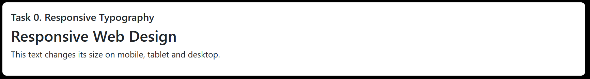
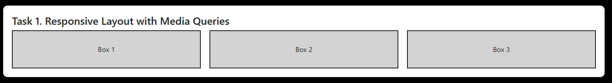
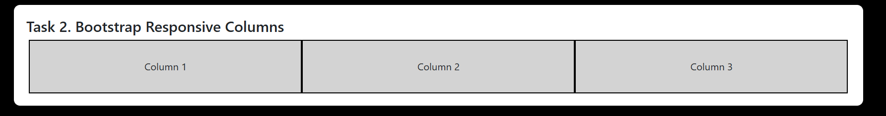
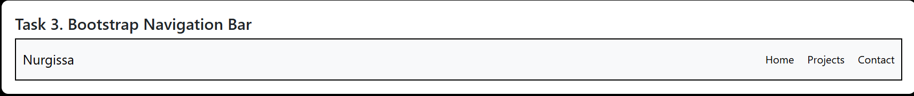
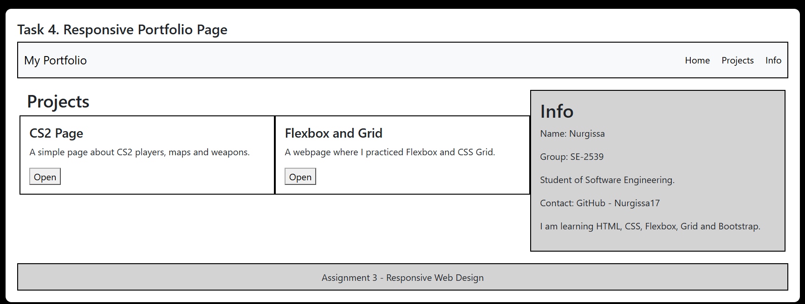

# Assignment 3. Responsive Web Design
**Name:** Pernebay Nurgissa  
**Group:** SE-2539

### Task 0. Responsive Typography
I created a heading and paragraph and used media queries to change their font sizes for mobile, tablet and desktop.

### Task 1. Responsive Layout with Media Queries
I created three boxes. On desktop they are displayed in one row, on tablet two boxes are displayed in the first row, and on mobile they are stacked vertically.

### Task 2. Bootstrap Responsive Columns
I used Bootstrap's 12-column grid system. On desktop the three columns are displayed in one row, on tablet two columns are displayed in the first row, and on mobile all columns are stacked.

### Task 3. Bootstrap Navigation Bar
I created a responsive Bootstrap navigation bar with the name on the left and links on the right. On smaller screens it collapses into a hamburger menu.

### Task 4. Responsive Portfolio Page
I created a responsive portfolio page using Bootstrap Grid and CSS Media Queries. It has a Bootstrap navbar, project cards on the left, personal information and contact details on the right, and a footer at the bottom.

## Summary
In this assignment I learned how to make a webpage responsive for different screen sizes. I used CSS Media Queries to change font sizes and layouts. I also used Bootstrap's 12-column grid system and a responsive Bootstrap navbar. In the last task I combined Bootstrap Grid with Media Queries in one portfolio page.
